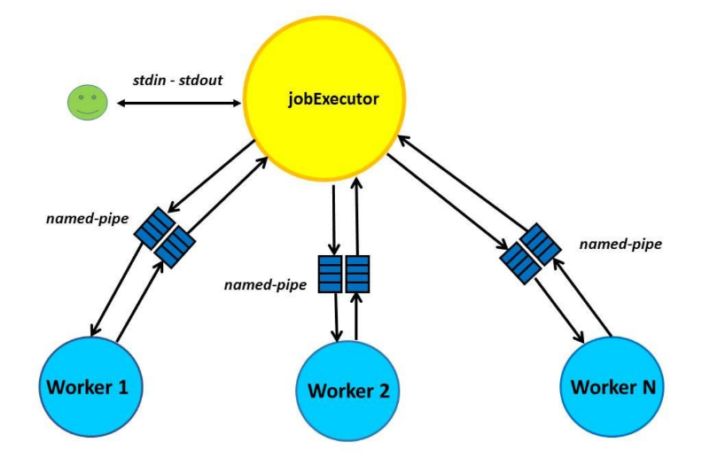

# Distributed-File-Management-Tool


### Table of Contents

[Introduction](#introduction)

[Inputs](#inputs)

[Processes communication](#process_comm)

[Application interface](#app_interface)

[Bash scripts](#bash_scripts)


<a name="introduction"/>

## Introduction

This projects implements a distributed file management tool.     
More specifically, it consists of the *jobExecutor* application that creates a series of *Worker* processes that alongside with the *jobExecutor* answer to user queries.

*Fork / exec* system calls, processes' communication through *named-pipes (FIFOs)*, 
*low-level I/O*, *signals* handling are included.

The [***Trie***](https://en.wikipedia.org/wiki/Trie) and the ***postings list*** data structures were used, as well, and their implementation were taken from the [***Mini Search Engine project***](https://github.com/JohnPapad/Mini-Search-Engine).

The project was developed for the class of ***"System Programing"*** in the Informatics Department, using **C++** *(without STL)* and **Object Oriented Programming practices**.


<a name="inputs"/>

## Inputs

The ***docfile*** (or any other file name) is a file that includes directory paths, that contain ASCII text files. Each line contains only one path.

> A demo input file ([demo_docfile](demo_docfile)) is provided, as well as the corresponding, necessary demo directories ([testing_dirs](testing_dirs)).


<a name="process_comm"/>

## Processes communication



In the beginning, the *jobExecutor* application reads the input file, initiates the *w* *Workers*
processes and evenly distribute the containing directory paths to *Workers*. The directories should be flat e.g. they should not contain sub-directories, but only text files.

The figure above depicts a representation of the application's structure. The communication between the *jobExecutor* and each *Worker* is conducted through *named pipes*. 

The *jobExecutor* informs a *Worker* that it intends to transfer a command to it, through the piping, so that the *Worker* be able to read it. 

If the *jobExecutor* is informed that a *Worker* has terminated (e.g. due to receiving a *SIGKILL signal*), it creates a new *Worker* and transfers the directories' pathnames, that the dead *Worker* was managing. When the status of a child-process changes, the Linux kernel sends the *SIGCHLD signal* to its parental process. Thus, the *jobExecutor* manages this signal in order to be notified of the status change, in any of the
*Workers*, and act properly.


<a name="app_interface"/>

## Application interface

A makefile is provided. You can use the command ```$ make``` for easy compilation, ```$ make clean``` to delete all **.o* auto generated files and ```$ make delete_logs``` to delete all generated *Workers'* logs in the [log folder](log).

To run the application use the command:   
```$ ./jobExecutor –d <docfile> –w <numWorkers>```

### Command line arguments

- ***-d*** : the input file name *(docfile by default)*.
- ***-w*** : the number of *Worker* processes that the application creates.

### Application commands

When the application finishes creating the *Worker* processes, it will wait for the user's input. The user will be able to give the following commands:

- ```/search q1 q2 q3 ... qN –d <deadline>```:   
The user searches for lines from the files that contain one or more of the ```q1,
q2, ... qN``` strings. The *jobExecutor* application sends the strings to all *Workers* and
expects answers from all of them, before presenting anything to the user. Every *Worker* searches all the files it manages and finds all the lines that contain at least one of the strings. For each file it finds, returns the path of the file, the number of each line containing some ```qi``` and the contents of the line, to the *jobExecutor*. If the *jobExecutor* does not receive a response from all *Workers* within a period of seconds *(deadline)*, it presents to the user only those answers received before the *deadline*, with a corresponding message (e.g. that only 3 of the 4 Workers answered).

- ```/maxcount <keyword>```:   
The user searches for the file that contains the keyword the most. *JobExecutor* sends the
keyword to all *Workers* and asks them to return the file that contains the specific word, the most
times. After collecting the maximum of all *Workers*, it prints an overall maximum to the user, i.e. the file that contains the specific word the most times.

- ```/mincount <keyword>```:  
Same as before but we are interested for the file that contains the specific word (among files that contain the word at least once), the minimum number of times. E.g the file that is being returned as a result should contain the word ≥ 1 times. If there is no file with this word a corresponding message is printed to the user.

- ```/wc```:   
The total number of characters (bytes), words and lines from all files, from all *Workers* are printed. *JobExecutor* ask all *Workers* about the corresponding partial statistics and then adds them up and print them to the user.

- ```/exit```:    
The *jobExecutor* notifies *Workers* to terminate. Before terminating, each *Worker* logs entries, in the ```log/Worker_XXX directory``` *(where XXX is its process id)*, of the following format:  

    ```
    Time of query arrival: Query type: string:
    pathname1: pathname2: pathname3: ...: pathnameN
    ```
    where ```pathname1 ... pathnameN``` are the file paths, where the string was found, in all files managed by the specific *Worker*. Furthermore, the *Worker* cleans up any data structure in use, informs the *jobExecutor* of the total number of strings found in its files, and terminates.


<a name="bash_scripts"/>

## Bash scripts

Three bash scripts (in the [log folder](log)), *```count_search.sh, get_maxcount_keyword.sh, get_mincount_keyword.sh```*, were also implemented. They read the log files created by the *Workers* (when terminating) and calculate the following statistics:

- ***Total number of keywords searched***: the number of search queries, that the *Workers* received in total.
- ***Keyword most frequently found***: ```<keyword> [totalNumFilesFound: XXX]```:    
the word *(keyword)*, that was found the most times
in all *Workers* files. 
    > Inside the brackets there is the number of files,that the keyword was found.


- ***Keyword least frequently found***: ```<keyword> [totalNumFilesFound: XXX]```:   
the word *(keyword)*, that was found the least times in all *Workers* files.
    > Inside the brackets there is the number of files,that the keyword was found.